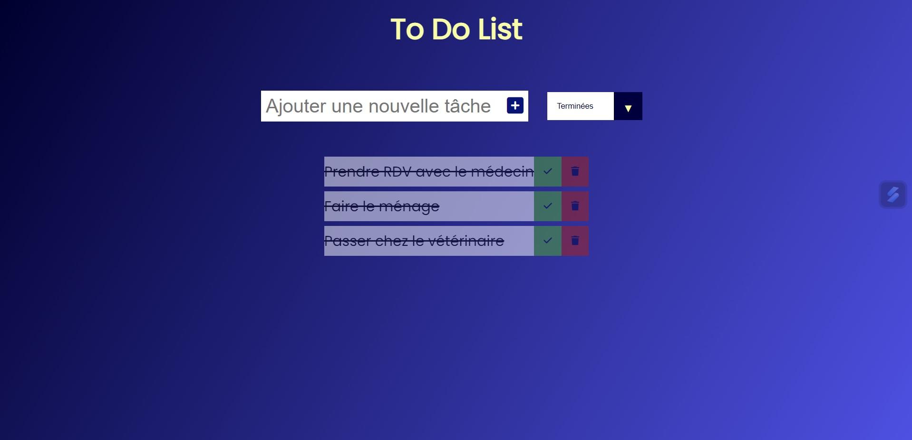
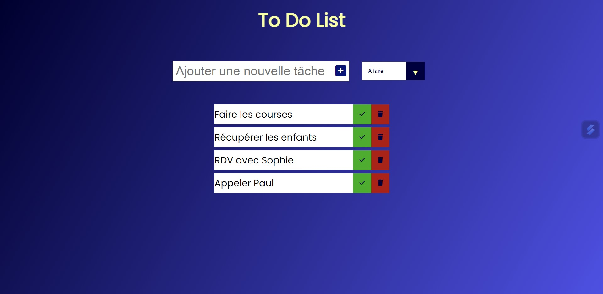

# 🗒️ To-Do List 🎯
 
 

## 📜 Présentation

Bienvenue dans To-Do List ! 🌟    

C'est une application web simple et élégante qui vous aide à organiser vos tâches et à rester productif.   

Avec une interface utilisateur moderne et intuitive, vous pouvez facilement ajouter, marquer comme complètes et supprimer vos tâches.

 

## 🚀 Fonctionnalités

- ✏️ Ajouter des tâches : Entrez une nouvelle tâche et cliquez sur le bouton pour l'ajouter à votre liste.   
- ✅ Marquer comme complètes : Cliquez sur le bouton de validation pour marquer une tâche comme complétée.   
- 🗑️ Supprimer des tâches : Cliquez sur le bouton de suppression pour enlever une tâche de la liste.   
- 🔍 Filtrer les tâches : Utilisez le menu déroulant pour afficher toutes les tâches, uniquement celles terminées ou celles à faire.   
- 💾 Sauvegarde locale : Les tâches sont stockées dans le stockage local de votre navigateur, donc pas de souci si vous fermez la page !   
  
 
 

## 🖼️ Aperçu

Voici à quoi ressemble l'application :   

[Démo vidéo du projet 🎥](https://www.youtube.com/watch?v=gEExBbF6ERY)

 
 

## 🌐 Lien direct

Pour l'utiliser : [To Do List 🙌](https://gabriellepagnard.github.io/ToDoList.github.io/)   

 
 

## 🛠️ Technologies Utilisées

- HTML 🏗️    
- CSS 🎨   
- JavaScript ⚙️   

 
 

## 📚 Fichiers du Projet

- index.html : Le fichier HTML principal   
- style.css : Les styles pour l'interface utilisateur   
- app.js : Le script JavaScript pour la logique du projet    
- ressources/ : Dossier contenant les images et les icônes (notamment les captures d'écran)   

 
 

## 💻 Installation

Pour exécuter ce projet sur votre machine locale, suivez ces étapes :   

➡️ Clonez le dépôt :   

`git clone https://github.com/yourusername/todolist.git`   

➡️ Accédez au répertoire du projet :   

`cd todolist`   

➡️ Ouvrez le fichier "index.html" dans votre navigateur pour voir l'application en action.   

 
 

## 🏗️ Comment Contribuer

Vous souhaitez contribuer ? 🎉 Voici comment faire :   

### Créer une Branche 🌿

➡️ Pour chaque nouvelle fonctionnalité ou correction, créez une nouvelle branche :   

`git checkout -b nom-de-la-branche`   

### Faire vos Changements ✏️   

Apportez les modifications nécessaires et committez-les :   

`git add .`   
`git commit -m "Description des changements"`   

### Pousser les Changements ⬆️   

Envoyez vos modifications à GitHub 📨 :

`git push origin nom-de-la-branche`   

### Créer une Pull Request 🔄   

Allez sur GitHub, ouvrez une Pull Request et expliquez vos modifications   

 
 

## 🤝 Contributeurs/trices

Gabrielle Pagnard 🧑‍💻 - Créatrice du projet

 
 

## 📞 Contact

Pour toute question ou suggestion, n'hésitez pas à me contacter :   

Email : gpagnard@gmail.com   
GitHub : [GabriellePagnard](https://github.com/GabriellePagnard)     

 
 
 

Merci d'avoir visité le projet To-Do List ! 🚀   

J'espère qu'il vous sera utile et agréable à utiliser. N'hésitez pas à laisser un ⭐ si vous aimez ce projet !